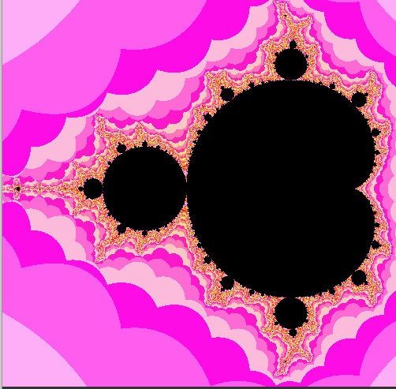
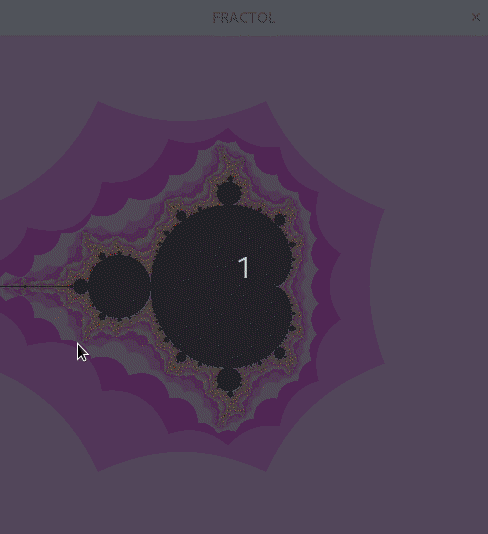
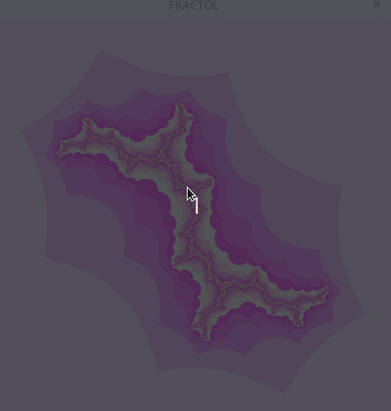

# Fractol

Fractol is a the first graphical project of 42. It is a tool designed to explore and visualize fractals.



## Table of Contents

- [Introduction](#introduction)
- [Features](#features)
- [Installation](#installation)
- [Fractal explorer](#explorer)

## Introduction

Fractals are fascinating mathematical objects that exhibit intricate patterns at every scale. Fractol provides a platform to generate, visualize, and explore various types of fractals. Whether you're a mathematician, a computer scientist, or simply curious about fractals, fractol offers an intuitive interface to interact with these mesmerizing structures.

## Features

- **Fractal Generation**: Generate popular fractals such as Mandelbrot Set and Julia Set
- **Interactive Visualization**: Zoom in real-time to explore fractals, dynamically adjusting based on mouse position for detailed examination of specific areas.

## Installation

To install Fractol, follow these steps:

1. Clone the repository:

    ```bash
    git clone https://github.com/Bussiereg/fractol.git
    ```

2. Navigate to the project directory:

    ```bash
    cd fractol
    ```

3. Build the project with the following command:
   ```bash
    make
    ```

5. Run the executable generated after the build process.
   - Mandelbrot set:
   ```bash
    ./fractol Mandelbrot
    ```
   
   - Julia set : you can generate different fractol playing with the 2 parameters after the Julia argument.
     For instance the 2 following examples create beautiful fractals:
     
    ```bash
    ./fractol Julia -0.8 0.156
    ```
    
    ```bash
    ./fractol Julia 0 1
    ```
## Explorer

### Mandelbrot



### Julia


